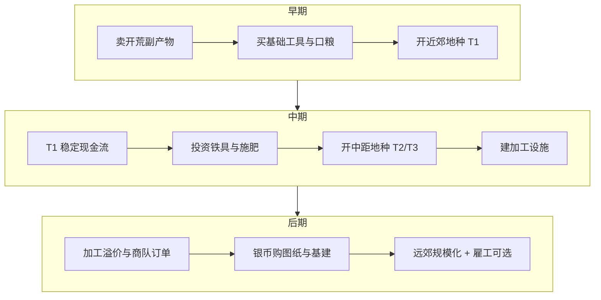

# 03 · 经济体系

[← 核心玩法](./02-核心玩法.md) | [返回索引](./README.md) | [下一章：随机事件 →](./04-随机事件系统.md)

---

经济体系采用 **「双货币 + 多资源 + 动态市场」** 结构，保证开荒、种植、交易每一环都有明确价值。

---

## 1. 货币设计

| 货币 | 获取 | 用途 | 设计意图 |
|------|------|------|----------|
| **铜币**（主货币） | 卖作物、完成任务、捡荒 | 买种子、普通工具、食物 | 日常循环 |
| **银币**（高级货币） | 大额交易、成就、商队稀有品 | 买图纸、高级工具、土地契约 | 中长期目标 |
| **声望/信誉**（软货币） | 完成商队订单、帮助 NPC | 解锁折扣、稀有种子、贷款额度 | 引导长线行为 |

**兑换关系**（固定，避免通胀失控）：

- 100 铜 = 1 银
- 声望不可直接换钱，只能换**机会**（独家商品、贷款）

---

## 2. 资源分类与经济角色

| 资源类型 | 例子 | 来源 | Sink（消耗出口） |
|----------|------|------|------------------|
| 可售农产品 | 土豆、小麦 | 种植 | 口粮、出售、加工 |
| 开荒副产物 | 石块、木材、纤维 | 开荒 | 建造、出售、燃料 |
| 工业中间品 | 面粉、布、木桩 | 加工 | 高级商品、任务 |
| 消耗品 | 食物、药水、燃料 | 购买/制作 | 精力恢复、烧荒、运输 |
| 固定资产 | 工具、设施、土地权 | 购买/建造 | 无直接消耗，占资金 |

**经济健康原则**：每一种资源至少对应 **1 个稳定来源 + 2 个以上消耗点**。

---

## 3. 价格形成机制

### 3.1 基础价格（锚定）

```
玩家出售价 = 基础价 × 品质系数 × 市场供需系数
玩家购买价 = 基础价 × 1.2～1.5 × 稀有度系数
```

### 3.2 动态供需（局部市场）

以**驿站市场**为核心，每周期刷新：

| 因素 | 影响 |
|------|------|
| 季节 | 秋季粮食收购价 ↑，春季种子价 ↑ |
| 玩家倾销 | 同一周期大量卖同种作物 → 收购价临时 ↓ 10%～30% |
| 商队需求 | 随机「本周高价收 X」→ 引导种植结构 |
| 事件 | 旱灾 → 水类作物价 ↑；瘟疫 → 药草价 ↑（见 [04-随机事件系统](./04-随机事件系统.md)） |

### 3.3 运输与时间成本

| 渠道 | 特点 |
|------|------|
| 近郊市场 | 即时交易，价格标准 |
| 远城商队 | 需运费 + 等待，但高价收购稀有品 |
| 策略选择 | **卖快 vs 卖贵** |

---

## 4. 成本—收益模型（开荒 ROI）

每块地有**开垦总成本**与**生命周期收益**，玩家可通过 UI 预估。

**开垦成本** = 精力成本（折算铜币等价）+ 工具损耗 + 时间机会成本 + 种子/肥料

### 示例：1 格石砾地 → 平整田

| 项目 | 数值 |
|------|------|
| 工作量 | 150 点 |
| 铁锄效率 | 1.4 |
| 实际劳动次数 | 约 11 次 |
| 精力消耗 | 约 220 点（≈ 2.2 日满额劳动） |
| 工具修理 | 15 铜 |
| 机会成本 | 若改种 T1，少收 40 铜/季 |
| **解锁后** | T2 作物季利润 +120 铜，约 2 季回本 |

**设计意图**：

- 近处低品质地：**快回本**，维持早期现金流
- 远处高品质地：**高门槛、高回报**，驱动中后期扩张

---

## 5. 现金流与生命周期



---

## 6. 通胀与回收（Sink）

| Sink 类型 | 具体设计 |
|-----------|----------|
| 工具修理/更换 | 持续消耗 |
| 土地契约 | 开新区域一次性大额 |
| 设施维护费 | 每季扣减 |
| 税收/驿站管理费 | 规模化后触发 |
| 雇工工资 | 用铜币换时间与精力 |
| 贷款利息 | 早期贷款开荒，后期本息回收 |
| 季节灾害修复 | 随机大额支出 |
| 防护设施 | 应对野生动物（见 [04-随机事件系统](./04-随机事件系统.md)） |
| 保险契约 | 每季保费，灾害时赔付 |

---

## 7. 信贷系统

| 项目 | 说明 |
|------|------|
| 驿站贷款 | 基于信誉，借铜/银开垦远处土地 |
| 利率 | 5%～15%/季，逾期降信誉 |
| 意义 | 允许「先开荒后还债」的激进玩法 |
| 灾害条款 | 极端事件后延期还款，换更高利息 |

---

## 8. 任务与订单经济

| 类型 | 奖励 | 作用 |
|------|------|------|
| 日常订单 | 铜 + 少量声望 | 引导当前能产的货 |
| 商队大宗订单 | 银 + 稀有种子 | 调节中期产能方向 |
| 主线任务 | 解锁区域/工具 | 节奏闸门 |
| 成就 | 称号、皮肤、小额属性 | 长期留存 |
| 灾后重建任务 | 铜 + 声望 | 事件后的经济缓冲 |

---

## 9. 事件与经济联动摘要

随机事件带来的损失与机会，统一进入玩家账本。详见 [04-随机事件系统 · 第 6 节](./04-随机事件系统.md#6-与经济体系的挂钩)。

| 事件类型 | 市场反应（滞后 1 周期） |
|----------|-------------------------|
| 区域干旱 | 本地粮价↑，种子价↑ |
| 洪涝 | 根类减产，土豆价↑ |
| 野猪泛滥 | 肉价↓（供应多），皮革稳定 |
| 虫害 | 农药、药草需求↑ |
