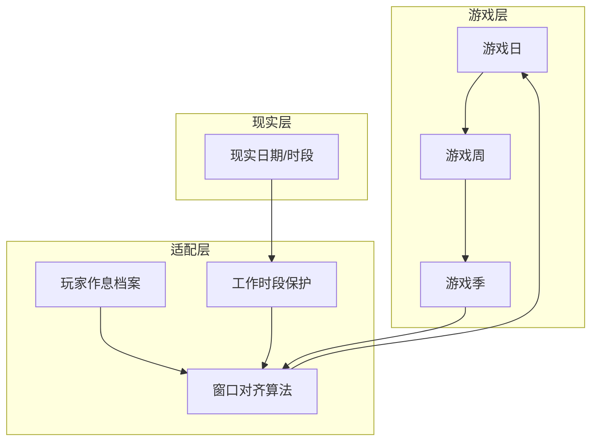
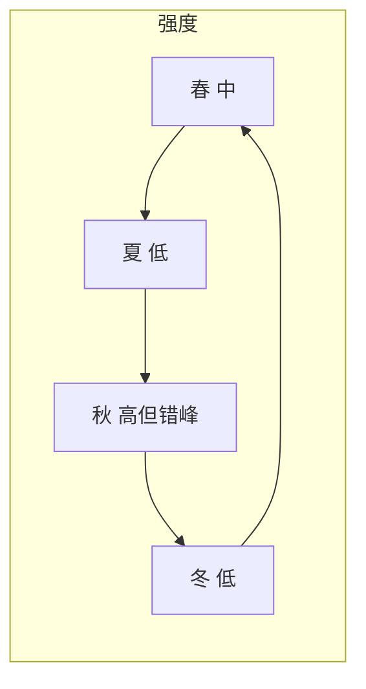

# 07 · 季节与时间节奏

[← 数值框架与UI](./06-数值框架与UI.md) | [返回索引](./README.md)

---

## 1. 设计目标

《开荒》的目标玩家大多是**利用碎片时间**的休闲用户——工作日白天上班，晚上或周末才能深入游玩。季节系统必须在保留策略深度的同时，避免以下体验：

| 反模式 | 后果 |
|--------|------|
| 上班时恰逢秋收高峰 | 用户无法操作，眼睁睁看过季 |
| 整季关键动作挤在 24 小时内 | 变成打卡上班，而非休闲农场 |
| 现实时间与游戏季节完全脱钩 | 无法预期何时需要「认真玩一把」 |
| 现实时间与游戏 1:1 绑定 | 出差/加班即必然崩盘 |

**核心原则**：

> **季节要有压力，但不能与用户的生活节奏作对。**

---

## 2. 双层时间结构

游戏采用 **「游戏日历」+「现实节奏适配层」** 双层结构：



| 层级 | 说明 |
|------|------|
| 游戏日历 | 春/夏/秋/冬，游戏日编号，作物生长、过季均基于此 |
| 现实节奏适配层 | 将游戏里程碑对齐到玩家可玩时段，工作时段降压 |
| 现实时间 | 可选：游戏日与现实日弱绑定，或完全由玩家手动推进 |

---

## 3. 季节跨度设计（推荐默认值）

### 3.1 一季多长？

采用 **「1 游戏季 ≈ 2 个现实周（14 天）」** 作为标准模式基准：

| 季节 | 现实跨度（标准） | 游戏日数 | 节奏定位 |
|------|------------------|----------|----------|
| 春 | 14 天 | 14 | 开荒、播种，中等强度 |
| 夏 | 14 天 | 14 | 维护、灌溉，偏低强度 |
| 秋 | 14 天 | 14 | 收获、出售，**高峰但有缓冲** |
| 冬 | 10 天 | 10 | 规划、加工、交易，低强度 |

**完整年轮** ≈ 52 现实天（约 7.5 周）。

设计意图：

- 单季足够长：即使连续 5 个工作日无法深玩，仍在季内
- 秋收横跨 2 个完整周末，降低「只能工作日收」的概率
- 冬季略短，作为节奏缓冲，避免全年同等压力

### 3.2 游戏日与现实日的关系

提供三种**时间推进模式**，玩家可在设置中切换（首次引导时推荐）：

| 模式 | 推进方式 | 适合人群 |
|------|----------|----------|
| **伴随模式**（默认） | 1 现实日 = 1 游戏日（0:00 或自定义日切） | 每日登录 15～30 分钟的轻度玩家 |
| **手动模式** | 玩家点击「结束今日」推进 | 时间不固定、不希望后台跑进度 |
| **周末模式** | 工作日游戏日冻结，仅周末推进 | 只有周末能玩的用户 |

> **关键**：无论哪种模式，**季节里程碑日期由适配层校准**，而非简单累加现实日。

### 3.3 一天需要玩多久？

| 日类型 | 目标在线时长 | 主要动作 |
|--------|--------------|----------|
| 平日低峰日 | 10～20 分钟 | 浇水、查看、轻度开荒 |
| 平日高峰日（预告） | 20～35 分钟 | 接近收割窗口时的提醒日 |
| 周末 | 40～90 分钟 | 集中开荒、批量收割、跑市场 |
| 抢收日 | 15 分钟也可完成最低限 | 支持「最小操作集」 |

**最小操作集**：一键查看待收列表 → 雇工代收 / 急收令 → 确认，确保忙日也不必然过季。

---

## 4. 玩家作息档案

### 4.1 首次引导（30 秒）

```
你通常什么时候方便打理农场？
  ○ 工作日晚上（默认 20:00–23:00）
  ○ 周末为主
  ○ 随时可玩（灵活）
  ○ 自定义时段
```

可选补充：

- 是否开启 **工作时段保护**（默认开启）
- 工作日保护时段（默认 Mon–Fri 09:00–18:00，可改）

### 4.2 作息档案字段

| 字段 | 用途 |
|------|------|
| `activeSlots` | 用户标记的高频游玩时段 |
| `protectedSlots` | 工作/睡觉等不可玩时段 |
| `timezone` | 日切与周末计算 |
| `paceMode` | 伴随 / 手动 / 周末 |
| `seasonLengthScale` | 0.8 休闲 / 1.0 标准 / 1.2 硬核 |

---

## 5. 工作时段保护机制

当玩家开启保护且当前处于 `protectedSlots` 内：

| 机制 | 行为 |
|------|------|
| 季节倒计时 | **暂停**（不扣「距季末剩余游戏日」） |
| 收割窗口 | **暂停关闭**（窗口剩余时间冻结） |
| 作物生长 | 继续（避免保护变成拖延漏洞）或降为 50% 速度（可配置） |
| 随机事件 | 进入**待处理队列**，不自动恶化；登录后 24h 内处理 |
| 推送通知 | 仅发送「温和提醒」，不在工作时段推送「即将过季！」 |

**设计边界**：

- 保护时段内**不能**执行需精力的高强度操作（本身用户也不在）
- 单次连续保护不超过 12 小时，防止滥用 7×24 冻结
- 每季保护累计上限：约 40% 的游戏时长（防止无限拖延季节）

---

## 6. 忙碌季错峰设计（秋季专项）

秋季是唯一的**系统性忙碌季**，需单独错峰，避免与用户工作周重叠：

### 6.1  staggered maturity（ staggered 成熟）

**禁止**全图作物在同一游戏日成熟。改为：

```
秋第 1 周：30% 地块进入收割窗口
秋第 2 周：40% 地块进入收割窗口（含 1 个完整周末）
秋第 3 周：剩余 30% + 抢收缓冲
```

### 6.2 窗口与现实对齐算法

每个收割窗口须满足：

```
窗口长度 ≥ 2 个活跃晚间段 + 1 个完整周末（标准模式）
```

算法伪逻辑：

1. 读取玩家 `activeSlots` 与 `paceMode`
2. 计算窗口开启的现实日期
3. 若窗口结束日落在工作日保护段内 → **延长窗口** 至下一个活跃时段起始
4. 季末「抢收日」优先落在**周六或周日**

### 6.3 秋季时间轴示例（标准模式 + 工作日晚上玩家）

| 现实日期 | 游戏阶段 | 玩家体验 |
|----------|----------|----------|
| 周一～周五 | 部分作物成熟 | 保护开启，窗口冻结；晚上收 1～2 块 |
| 周六～周日 | 批量成熟高峰 | 集中收割，策略深度最高 |
| 次周周一～三 | 尾批成熟 | 低压力收尾 |
| 次周周末 | 抢收日 | 最后缓冲，产量 -30% 仍可收 |

---

## 7. 四季强度曲线（对齐生活节律）



| 季节 | 强度 | 工作日出勤要求 | 说明 |
|------|------|----------------|------|
| 春 | ★★★ | 低 | 播种期错开，单日错过影响小 |
| 夏 | ★★ | 极低 | 以等待生长为主，适合出差 |
| 秋 | ★★★★ | **周末集中** | 唯一 busy season，但有保护+错峰 |
| 冬 | ★ | 极低 | 菜单操作为主，无过季压力 |

**全年规则**：不存在「连续 2 季都是 busy season」的设计。

---

## 8. 节奏模式对照表

| 模式 | 1 季现实长度 | 保护默认 | 适合 |
|------|--------------|----------|------|
| 休闲 | 18～21 天 | 开，上限 50% | 加班多、偶发登录 |
| 标准 | 14 天 | 开，上限 40% | 大多数用户 |
| 硬核 | 10 天 | 关 | 愿意每日管理的玩家 |

作物生长速度、窗口长度随 `seasonLengthScale` 同比缩放，保持「种得下、收得及」的比例不变。

---

## 9. 无法登录时的兜底

| 兜底 | 触发 | 效果 |
|------|------|------|
| 雇工代收 | 已雇佣 + 窗口期内 | 自动收 80% 产量，防硬损 |
| 离线队列 | 保护关但 48h 未登录 | 事件不恶化，窗口暂停至登录 |
| 季末邮件 | 过季前 72h / 24h | 推送 + 游戏内「待办清单」 |
| 新手豁免 | 第 1 季 | 过季损失减半 + 窗口自动延长 1 游戏日 |
| 出差模式 | 玩家手动开启，每季 1 次，≤5 天 | 全季倒计时暂停，生长 50% |

---

## 10. UI 与沟通

### 10.1 季节日历（增强）

在 [06-数值框架与UI](./06-数值框架与UI.md) 基础上增加：

| 元素 | 说明 |
|------|------|
| 现实日期对照 | 游戏日 ↔ 现实日期并排显示 |
| 活跃时段标记 | 高亮「你的常用游玩时间」 |
| 忙碌预测 | 「本周六建议预留 45 分钟收割」 |
| 保护状态 | 图标显示当前是否处于工作保护 |
| 季末倒计时 | 显示「有效倒计时」（扣除保护冻结时间） |

### 10.2 文案原则

- ✅ 「本周末有 6 块地进入收割窗口，建议周六上午处理」
- ❌ 「23 小时后强制过季！」（易制造上班焦虑）

---

## 11. 与现有系统的关系

| 系统 | 关联 |
|------|------|
| [5.3 收割窗口与过季损失](./02-核心玩法.md#53-收割窗口与过季损失) | 窗口长度、抢收日规则不变；适配层负责**对齐现实可玩时段** |
| [03 经济体系](./03-经济体系.md) | 雇工、收割保险在 busy season 价值更高 |
| [04 随机事件](./04-随机事件系统.md) | 工作保护期间事件排队，不抢时间槽 |
| [本地天气](./04-随机事件系统.md#3-本地天气接入方案) | 仅权重修正，**不**加速季节或窗口 |

---

## 12. 配置参考

见 [config/season-calendar.json](../config/season-calendar.json)。

---

## 13. 设计验收标准

上线前用以下场景走查：

1. **上班族**：Mon–Fri 9–18 不可玩，仅 20–22 点 + 周末 → 首年秋零过季  
2. ** weekend 党**：仅 Sat–Sun 玩 → 周末模式下单季可完成基本 loop  
3. **硬核每日**：关闭保护 → 14 天内每日 20 分钟可收全图  
4. **出差 5 天**：出差模式或离线队列 → 不因此季末崩盘  
