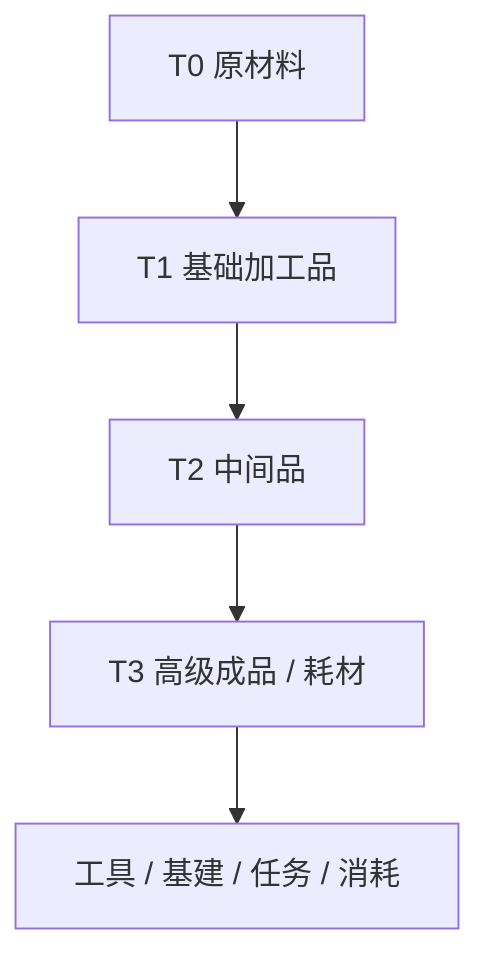
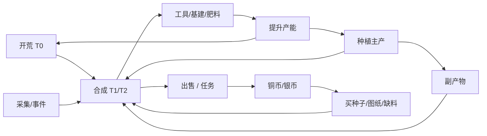

# 08 · 材料合成与产出

[← 作物生长与时间节奏](./07-作物生长与时间节奏.md) | [返回索引](./README.md) | [下一章：生活与社群 →](./09-生活与社群.md)

---

## 1. 设计目标

材料体系是连接**开荒、种植、工具、基建、市场**的中枢。设计须满足：

| 目标 | 说明 |
|------|------|
| 来源清晰 | 每种材料有稳定、可预期的产出路径 |
| 合成有价 | 加工带来合理溢价，但不碾压「直接卖原料」 |
| 消耗持续 | 每种材料 ≥2 个 Sink，避免囤积无意义 |
| 阶段分层 | 早期靠副产物，中期靠合成链，后期靠稀有材料 |
| 经济可控 | 可配置产出率、配方转化率，便于数值调平 |

**核心公式**：

```
材料价值锚定铜币 → 配方产出价 ≈ 投入原料价 × (1.15～1.5) + 时间成本
```

---

## 2. 材料分级与分类

### 2.1 四级材料金字塔



| 层级 | 定位 | 例子 | 典型来源 |
|------|------|------|----------|
| **T0** | 原材料 | 原木、石块、野纤维、粘土、铜矿石 | 开荒、采集、种植副产物 |
| **T1** | 基础加工 | 木板、石砖、麻绳、木炭、粗铁锭 | 初级工作台合成 |
| **T2** | 中间品 | 铁钉、肥料、皮革、面粉、粗布 | 专属设施合成 |
| **T3** | 高级品 | 精铁件、复合肥料、药剂、栅栏套件 | 高级设施 + 稀有 T0 |

### 2.2 功能标签（交叉分类）

| 标签 | 用途 | 代表材料 |
|------|------|----------|
| `building` | 基建、围栏 | 石砖、木板、麻绳 |
| `tool` | 工具制造与修理 | 粗铁锭、精铁件、木柄 |
| `farm` | 种植增益 | 肥料、 compost、种子载体 |
| `fuel` | 烧荒、冶炼、恢复 | 木炭、麦秆、油脂 |
| `trade` | 高溢价出售 | 布匹、面包、药剂 |
| `consumable` | 一次性消耗 | 食物、药水、诱饵 |

---

## 3. 材料产出机制

### 3.1 产出源总览

| 产出源 | 触发时机 | 主要材料 | 经济角色 |
|--------|----------|----------|----------|
| **开荒** | 锄地、割草、碎石 | 石块、原木、野纤维 | 早期免费供给，降低起步门槛 |
| **种植** | 收割作物 | 农产品 + 副产物（麦秆、棉籽） | 主现金流 + 加工原料 |
| **分解** | 工具报废、事件残骸 | 废铁、碎木 | 回收 Sink 的反向补充 |
| **狩猎/事件** | 野兽、灾害后 | 兽皮、骨、鱼 | 波动供给，调节价格 |
| **采集点** | 远郊固定节点 | 铜矿石、粘土、树脂 | 中期瓶颈，驱动扩张 |
| **商队** | 每 7 日刷新 | 稀缺 T0/T1（溢价购买） | 缺货时的货币 Sink |
| **雇工** | 被动收集 | 低量副产物 | 轻度补充，非主来源 |

### 3.2 开荒产出（与地块绑定）

| 障碍类型 | 固定产出 | 概率额外 | 产出上限 |
|----------|----------|----------|----------|
| 高草/灌木 | 野纤维 ×2 | 原木 ×1（30%） | 每格仅首次开荒掉落 |
| 板结土 | 粘土 ×1 | — | 每 2 格 1 次 |
| 石块 | 石块 ×3 | 铜矿石 ×1（10%，远郊） | 每格 |
| 树根 | 原木 ×2 | 树脂 ×1（15%） | 每格 |

**平衡**：开荒材料不可无限刷——同一格完成「可种植」后不再产出 T0，迫使玩家向新地块扩张或转向种植/采集。

### 3.3 种植产出（主循环）

| 作物 | 主产出 | 副产物（100%） | 副产物用途 |
|------|--------|----------------|------------|
| 土豆 | 土豆 ×4 | 土豆藤 ×1 | 堆肥 → 肥料原料 |
| 小麦 | 小麦 ×3 | 麦秆 ×2 | 燃料 / 粗纸 |
| 玉米 | 玉米 ×3 | 玉米芯 ×1 | 燃料 |
| 棉花 | 棉花 ×2 | 棉籽 ×1 | 榨油 / 饲料 |
| 药草 | 药草 ×2 | 药渣 ×1 | 低级肥料 |

副产物占背包但市场收购价低，**引导玩家合成而非直接卖**。

### 3.4 采集点（中期解锁）

| 节点 | 解锁条件 | 产出 | 刷新 |
|------|----------|------|------|
| 粘土坑 | 开中距 5 格 | 粘土 ×3/次 | 每 4 现实小时 |
| 铜矿脉 | 开远郊 + 鹤嘴锄 | 铜矿石 ×2/次 | 每 8 现实小时 |
| 树脂树 | 灌木区 | 树脂 ×1/次 | 每 6 现实小时 |

采集消耗**精力 + 时间槽**，与种植争资源，形成取舍。

### 3.5 事件与狩猎产出

| 来源 | 材料 | 频率 |
|------|------|------|
| 野兔/野猪 | 兽肉、兽皮 | 事件结算 |
| 洪涝后 | 鱼、粘土 | II 级事件 |
| 工具损坏 | 废铁 ×1 | 耐久归零 |

---

## 4. 合成系统

### 4.1 设施与配方解锁

| 设施 | 解锁 | 可合成层级 | 建造材料 |
|------|------|------------|----------|
| 初级工作台 | 初始 | T0 → T1 | 木板 ×10 + 石块 ×5 |
| 熔炉 | Lv5 | 矿物 → 铁锭 | 石砖 ×15 + 木炭 ×5 |
| 磨坊 | Lv6 | 谷物 → 面粉/饲料 | 木板 ×20 + 石砖 ×10 |
| 织机 | Lv8 | 纤维/棉 → 布 | 木板 ×15 + 麻绳 ×5 |
| 炼药台 | Lv10 | 药草 → 药剂 | 石砖 ×10 + 精铁件 ×2 |
| 工匠铺 | Lv12 | T2 → T3 工具件 | 精铁件 + 木板 |

### 4.2 合成流程

```
选择设施 → 选择配方 → 投入材料（+ 可选铜币手续费）→ 占用队列时间 → 收取成品
```

| 规则 | 说明 |
|------|------|
| 队列 | 每设施默认 1 队列，可升级至 2 |
| 时间 | 现实时间，可离线；T1 约 5～15 分钟，T3 约 30～60 分钟 |
| 批量 | 支持 ×1 / ×5 / ×10，时间线性叠加 ×0.9 效率奖励 |
| 失败 | 无失败机制；事件可能暂停队列（暴雨 +10 分钟） |
| 绑定 | 成品可交易；任务专用物品可绑定 |

### 4.3 核心配方表

#### T0 → T1（初级工作台）

| 成品 | 材料 | 时间 | 基础出售价 |
|------|------|------|------------|
| 木板 ×1 | 原木 ×2 | 5 分钟 | 6 铜 |
| 石砖 ×1 | 石块 ×2 | 5 分钟 | 8 铜 |
| 麻绳 ×1 | 野纤维 ×3 | 8 分钟 | 10 铜 |
| 木炭 ×1 | 原木 ×1 + 麦秆 ×1 | 10 分钟 | 7 铜 |

#### T1 → T2（专属设施）

| 成品 | 材料 | 设施 | 时间 | 基础出售价 |
|------|------|------|------|------------|
| 粗铁锭 ×1 | 铜矿石 ×2 + 木炭 ×2 | 熔炉 | 15 分钟 | 25 铜 |
| 面粉 ×1 | 小麦 ×2 | 磨坊 | 10 分钟 | 18 铜 |
| 粗布 ×1 | 棉花 ×2 + 麻绳 ×1 | 织机 | 20 分钟 | 35 铜 |
| 基础肥料 ×1 | 土豆藤 ×2 + 粘土 ×1 + 药渣 ×1 | 工作台 | 12 分钟 | 15 铜 |
| 铁钉 ×5 | 粗铁锭 ×1 | 熔炉 | 8 分钟 | 20 铜 |

#### T2 → T3（高级）

| 成品 | 材料 | 设施 | 时间 | 基础出售价 |
|------|------|------|------|------------|
| 精铁件 ×1 | 粗铁锭 ×2 + 木炭 ×1 | 工匠铺 | 25 分钟 | 55 铜 |
| 复合肥料 ×1 | 基础肥料 ×2 + 兽骨 ×1 | 工作台 | 15 分钟 | 40 铜 |
| 面包 ×1 | 面粉 ×1 + 燃料 ×1 | 磨坊 | 8 分钟 | 28 铜 |
| 初级药剂 ×1 | 药草 ×2 + 树脂 ×1 | 炼药台 | 30 分钟 | 65 铜 |
| 栅栏套件 ×1 | 木板 ×3 + 麻绳 ×1 + 铁钉 ×3 | 工匠铺 | 20 分钟 | 45 铜 |

### 4.4 溢价与「卖原料 vs 合成」平衡

**设计规则**：成品收购价必须 **高于** 等量原料直接出售之和，但需扣除**时间机会成本**后仍有优势，否则玩家只会卖原料。

```
合成净利润 = 成品收购价 - Σ(原料收购价) - 时间折算铜 - 设施折旧
```

| 配方类型 | 原料总价 | 成品价 | 溢价率 | 时间 | 净增益（标准） |
|----------|----------|--------|--------|------|----------------|
| 木板 | 4 铜 | 6 铜 | 1.50× | 5min | +1 铜（新手友好） |
| 粗铁锭 | 14 铜 | 25 铜 | 1.79× | 15min | +6 铜 |
| 面包 | 22 铜 | 28 铜 | 1.27× | 8min | +3 铜 |
| 初级药剂 | 45 铜 | 65 铜 | 1.44× | 30min | +12 铜 |

**防刷机制**：

- 同一成品在 7 日内大量上架 → 市场收购价 -10%～25%
- 商队订单随机高价收 T2/T3，引导阶段性产能
- 高级配方需**声望/图纸**，防早期跨级合成

---

## 5. 材料 Sink（消耗出口）

确保每种材料有稳定去向：

| 材料 | Sink 1 | Sink 2 | Sink 3 |
|------|--------|--------|--------|
| 木板/石砖 | 建造设施 | 围栏维修 | 商队订单 |
| 粗铁锭/精铁件 | 工具锻造 | 工具修理 | 高级基建 |
| 肥料 | 种植消耗（每块 1） | 合成复合肥料 | — |
| 木炭/麦秆 | 熔炼燃料 | 烧荒 | 食物加工 |
| 粗布/面包 | 出售 | 任务交付 | 雇工口粮（减工资） |
| 药剂 | 事件恢复 | 高价商队 | 保险减免 |
| 栅栏套件 | 野兽防护 | 维护消耗 | — |
| 兽皮 | 皮革合成 | 任务 | — |

### 5.1 工具修理的材料 Sink

| 工具 | 修理材料 | 占新造比例 |
|------|----------|------------|
| 铁锄 | 粗铁锭 ×1 + 木柄 ×1 | ~40% |
| 鹤嘴锄 | 精铁件 ×1 | ~35% |

修理比新购便宜，但**持续消耗 T1/T2**，连接开荒-合成-使用闭环。

### 5.2 基建一次性 + 维护

| 设施 | 建造消耗 | 每周期维护 |
|------|----------|------------|
| 熔炉 | 石砖 ×15 + 木炭 ×5 | 木炭 ×2 或 5 铜 |
| 织机 | 木板 ×15 + 麻绳 ×5 | 麻绳 ×1 或 8 铜 |

---

## 6. 经济平衡框架

### 6.1 全链路闭环



### 6.2 阶段供给预期（标准玩家）

| 阶段 | 主要材料来源 | 主要 Sink | 铜币流向 |
|------|--------------|-----------|----------|
| 早期（Lv1～5） | 开荒 T0、T1 作物 | 工作台、首套铁具 | 卖农产品 + 少量木板 |
| 中期（Lv6～12） | 副产物、采集点 | 熔炉/磨坊/肥料 | 合成 T2 卖商队 |
| 后期（Lv13+） | 矿脉、T3 作物 | 精铁、药剂、维护 | 高溢价订单 + 银币 |

### 6.3 通胀控制

| 手段 | 说明 |
|------|------|
| 原料市场倾销惩罚 | 7 日内同材料卖超阈值 → 收购价↓ |
| 合成手续费 | 部分 T3 配方 +5～10 铜 |
| 设施维护 | 每 7 日消耗材料或铜 |
| 背包/storage 扩容费 | 铜币 Sink |
| 不可无限开荒 | 同一格仅首次掉 T0 |

### 6.4 缺货与过剩调节

| 状态 | 系统反应 |
|------|----------|
| 服务器/个人囤积过多 | 商队下一周期提高该材料订单价 |
| 长期滞销 | NPC 收购价逐步下调至下限（基础价 ×0.6） |
| 关键瓶颈（如铜矿石） | 商队限量出售 + 采集点刷新 |

### 6.5 数值验收清单

1. 纯卖 T0 不合成 → 铜币收入比合成路线低 **15%～30%**
2. 全程合成不种植 → 缺肥料/药草，产能下降 **40%+**
3. 每种 T1 材料至少 **3 条**配方消耗路径
4. 修理工具 10 次的材料成本 ≈ 新工具价的 **60%～80%**

---

## 7. UI 要点

| 界面 | 功能 |
|------|------|
| 材料图鉴 | 来源、用途、当前市价、库存 |
| 合成台 | 配方列表、可制作数量、溢价预览 |
| 产出计算器 | 「卖原料 vs 合成」净利润对比 |
| 背包预警 | 某材料连续 3 周期无 Sink 消耗时提示 |

---

## 8. 配置参考

- [config/materials.json](../config/materials.json) — 材料定义与基础价
- [config/recipes.json](../config/recipes.json) — 配方与设施

---

## 9. 相关文档

- 经济总览：[03-经济体系](./03-经济体系.md)
- 开荒产出：[02-核心玩法 · 第 3 节](./02-核心玩法.md#3-土地与开荒系统)
- 种植副产物：[02-核心玩法 · 5.1](./02-核心玩法.md#51-作物分级)
