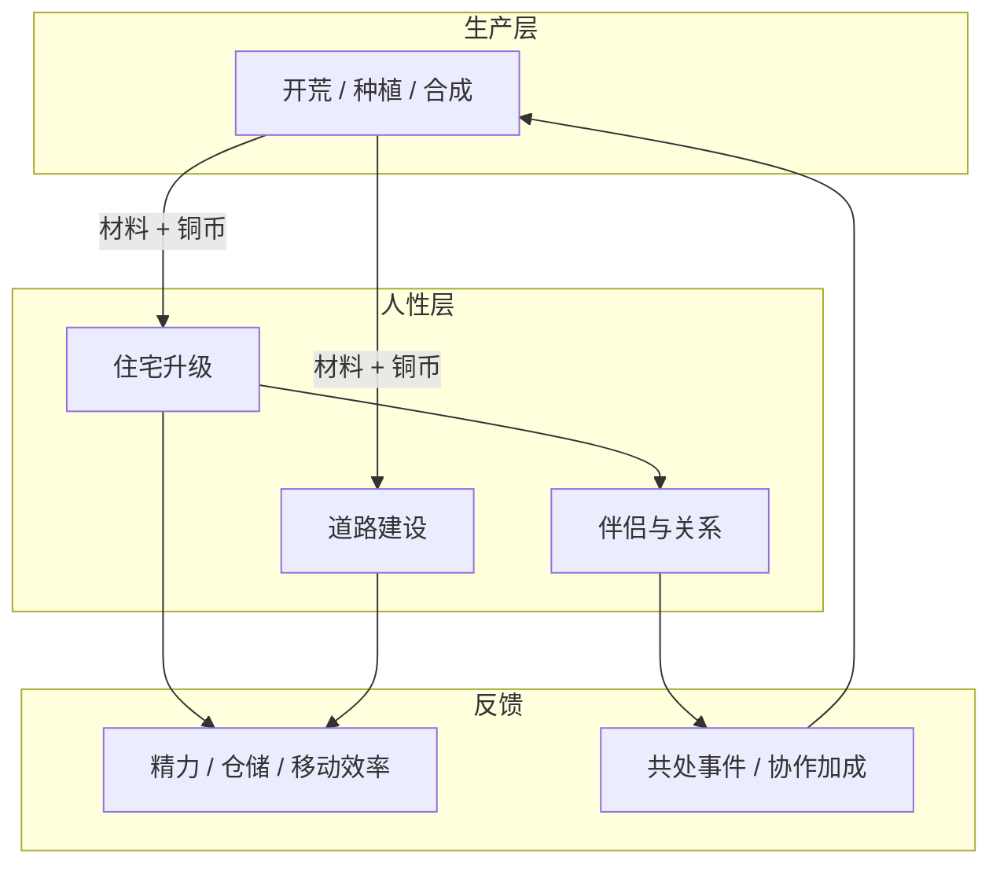

# 09 · 生活与社群（人性层）

[← 材料合成与产出](./材料合成与产出.md) | [返回索引](./README.md)

---

## 1. 设计定位

农场不仅是生产机器，也是**人安身立命、建立关系的地方**。「人性层」在核心经济 loop 之上，回答：

> **我为什么要这么辛苦开荒？为了谁、在哪个家、走什么样的路。**

| 维度 | 作用 |
|------|------|
| 情感锚点 | 从「刷资源」到「建设自己的生活」 |
| 长期目标 | 住宅、道路、伴侣提供跨周期的追求 |
| 经济 Sink | 大额材料与铜币消耗，平衡中后期通胀 |
| 节奏调节 | 生活建设不抢作物成熟时间，适合碎片期操作 |

**设计原则**：

1. **生活增益是便利，不是战力**——不破坏种植/开荒公平性  
2. **可见可预期**——每级住宅、每段道路目标清晰  
3. **关系靠相处**——伴侣通过互动与共同劳动建立，非抽卡  
4. **可慢可快**——不推进生活线也能玩通农场；推进则体验更完整  

---

## 2. 系统总览



---

## 3. 住宅升级

### 3.1 叙事起点

玩家初到荒原，仅有**旧驿站让出的漏风草屋**（Lv0）。随着农场扩大，逐步修缮、扩建为真正可称之为「家」的居所。

### 3.2 住宅等级

| 等级 | 名称 | 视觉 | 解锁条件 | 建造消耗（示例） |
|------|------|------|----------|------------------|
| Lv0 | 漏风草屋 | 单室茅屋 | 初始 | — |
| Lv1 | 稳固农舍 | 木石结构 | 开荒 10 格 | 木板 ×20 + 石砖 ×10 + 80 铜 |
| Lv2 | 带院农舍 | 小院子、柴房 | Lv5 + 声望 30 | 木板 ×40 + 石砖 ×25 + 麻绳 ×10 + 200 铜 |
| Lv3 | 两层农庄 | 二楼起居、一楼仓储 | Lv10 + 声望 80 | 精铁件 ×5 + 粗布 ×10 + 500 铜 |
| Lv4 | 田庄大宅 | 独立厨间、客卧 | Lv15 + 伴侣可邀请同住 | 精铁件 ×10 + 粗布 ×20 + 1 银 |
| Lv5 | 荒原庄园 | 完整庄园外观 | Lv25 + 主线章完成 | 高级材料包 + 3 银 |

### 3.3 住宅增益（数值克制）

| 等级 | 增益 | 说明 |
|------|------|------|
| Lv1 | 精力上限 +10 | 休息质量改善 |
| Lv2 | 仓储 +30% | 材料/作物堆叠上限 |
| Lv3 | 每日首次睡眠恢复 100% | Lv0～2 为 80% |
| Lv4 | 雇工上限 +1；伴侣可激活协作 | 生活与生产交汇 |
| Lv5 | 全区域移动精力 -5%；庄园声望订单 | 终局象征 |

**维护 Sink**：每 **48 现实小时**消耗木板 ×2 或 15 铜，否则增益降至 50%（不剥夺等级）。

### 3.4 室内互动（轻量）

| 互动 | 消耗 | 效果 |
|------|------|------|
| 整理居所 | 5 精力 | 临时 buff：下 5 次开荒工作量 -5% |
| 壁炉休息 | 木炭 ×1 | 即时恢复精力 30 |
| 装饰位 | 外观铜币 Sink | 纯展示，无数值（可付费皮肤） |

---

## 4. 道路建设

### 4.1 功能定位

道路连接**居所 ↔ 农田 ↔ 采集点 ↔ 驿站**，体现「从荒径到坦途」的开拓感，同时提供可量化的移动效率增益。

### 4.2 道路类型

| 类型 | 建造 | 效果 | 视觉 |
|------|------|------|------|
| 土路 | Clay ×3 / 格 | 该格移动精力 -1 | 踩出的小径 |
| 碎石路 | 石砖 ×1 + 木板 ×1 / 格 | 移动精力 -2；推车可用 | 灰白路面 |
| 木板道 | 木板 ×2 / 格 | 移动精力 -2；雨天不减速 | 湿地/沼泽必备 |
| 庄园大道 | 石砖 ×2 + 精铁件 ×1 / 3 格 | 全链路 -3；商队抵达加速 | 后期景观 |

### 4.3 建设规则

```
选择起点格 → 选择终点格 → 自动寻路铺路段 → 消耗材料 + 精力 + 游戏内时间
```

| 规则 | 说明 |
|------|------|
| 分段建造 | 可只铺「家到最近田块」，不必一次铺完 |
| 不可逆（可升级） | 土路可升级为碎石路，返还 50% 旧材料 |
| 区域解锁 | 铺至远郊节点才解锁「稳定采集」交互 |
| 维护 | 每 **48h** 未维护路段，效果 -1 级（最低维持土路） |

### 4.4 经济与策略

- **材料 Sink**：中后期木板、石砖持续消耗  
- **规划取舍**：先铺田还是先铺矿点，影响日常精力分配  
- **伴侣协作**：伴侣可「代为巡检道路」，维护费 -20%  

---

## 5. 伴侣系统

### 5.1 设计取向

伴侣是**共同开荒的同行者**，不是战斗单位，也不是抽卡商品。通过**相识 → 相知 → 同住 → 协作**推进。

### 5.2 可结识角色（示例）

| 角色 | 身份 | 擅长 | 初始出现 |
|------|------|------|----------|
| **阿禾** | 前驿站学徒 | 种植、记账 | Lv3 驿站 |
| **老周** | 流浪铁匠 | 工具修理、合成 | Lv6 商队 |
| **苏青** | 采药人 | 药草、事件应对 | 远郊药草区 |
| **小禾** | 护林人 | 驱兽、道路维护 | 中距灌木区 |

> 玩家可选择一位作为伴侣（单伴侣制），也可保持独身，不影响主线通关。

### 5.3 关系阶段


| 阶段 | 条件示例 | 解锁 |
|------|----------|------|
| 相识 | 完成 1 次个人任务 | 对话、赠礼 |
| 朋友 | 好感 30 + 赠礼 ×3 | 偶尔来帮 1 次忙 |
| 伙伴 | 好感 60 + 住宅 Lv2 | 每 **48h** 1 次协作技能 |
| 伴侣 | 好感 100 + 住宅 Lv4 + 可选定情任务 | 同住、常驻协作 |

**好感来源**（无付费捷径）：

- 赠礼（偏好作物/材料，错礼仅 +1，对礼 +5～10）
- 共同劳动（一起完成一次收割/开荒，+3）
- 主线/个人剧情节点（+10～20）
- 长期忽视（**48h** 无互动 -2，不低于当前阶段下限）

### 5.4 伴侣协作（数值克制）

| 能力 | 频率 | 效果 |
|------|------|------|
| 代收成熟作物 | 每日 1 次 | 同雇工 80% 产量 |
| 道路巡检 | 每 **48h** | 道路维护费 -20% |
| 合成协助 | 每 **48h** 2 次 | 合成队列时间 -15% |
| 事件陪伴 | 随机 | 兽害/灾害应对多 1 个选项 |

**不提供的加成**：作物生长加速、直接加铜币、战斗属性——避免「为了强度而结婚」。

### 5.5 同住与生活事件

住宅 Lv4 后开启**同住**，触发轻量生活事件链：

> **阿禾**：「东边的田今晨起了雾，我帮你把熟了的萝卜收进仓了。晚上……能一起把账目核对一下吗？」

| 事件类型 | 作用 |
|----------|------|
| 日常对话 | 世界观、情感反馈 |
| 共同晚餐 | 消耗食材，双方好感 +5，精力恢复 +10 |
| 小冲突与和解 | 选择不同态度，影响短期好感 |
| 纪念日 | 游戏内「第一次收成」等节点，解锁外观 |

### 5.6 伦理与可选性

- 任意阶段可保持朋友关系，不强制推进伴侣  
- 无性别锁死增益，角色仅偏好礼物类型不同  
- 无分手惩罚：若选择疏远，协作加成关闭，不回收住宅等级  

---

## 6. 社群与邻居（轻量）

| NPC | 作用 |
|-----|------|
| 驿站掌柜 | 商队、贷款、生活传闻 |
| 流浪商队 | 材料买卖、伴侣角色引荐 |
| 邻庄信使 | 每 **48h** 带来「邻区缺粮/缺布」订单，连接人性层与经济 |

**人性反馈**：住宅等级越高，信使称呼从「过路的」变为「庄主」——纯文本，零数值。

---

## 7. 与经济体系的衔接

### 7.1 资源 Sink 汇总

| 系统 | 铜币 | 材料 | 声望 |
|------|------|------|------|
| 住宅升级 | 中～高 | 木板、石砖、精铁、粗布 | 部分等级需要 |
| 道路 | 低（维护） | 粘土、石砖、木板持续 | — |
| 伴侣赠礼 | — | 作物/合成品 | 伙伴阶段需声望 |
| 生活维护 | 每 **48h** | 木板/木炭 | — |

### 7.2 与生产 loop 的优先级张力

玩家常面临：

```
「这 200 铜是换铁锄，还是升 Lv2 农舍？」
「先铺去矿点的路，还是先囤肥料种 T3？」
「今天去送礼，还是先把 45 分钟药草收完？」
```

这是**人性层存在的经济意义**——不是额外刷分，而是让资源分配有情感权重。

### 7.3 阶段建议

| 阶段 | 生活线目标 |
|------|------------|
| 早期 | Lv1 住宅 + 家到首块田的土路 |
| 中期 | Lv2～3 住宅 + 碎石路网 + 结识 1 位角色 |
| 后期 | Lv4 同住 + 庄园大道 + 伴侣协作常态化 |

---

## 8. UI 要点

| 界面 | 内容 |
|------|------|
| 家园视图 | 住宅外观、升级进度、维护状态 |
| 道路模式 | 地图铺路与升级预览、材料消耗 |
| 关系面板 | 好感、阶段、赠礼记录、协作冷却 |
| 生活日志 | 「今日谁帮了你什么」——强化人性反馈 |

---

## 9. 配置参考

见 [life-progression.json](../../config/life-progression.json)。

---

## 10. 相关文档

- 材料消耗：[08-材料合成与产出](./材料合成与产出.md)
- 经济 Sink：[03-经济体系](./经济体系.md)
- 雇工对比：[05-进度与成长](./进度与成长.md)
