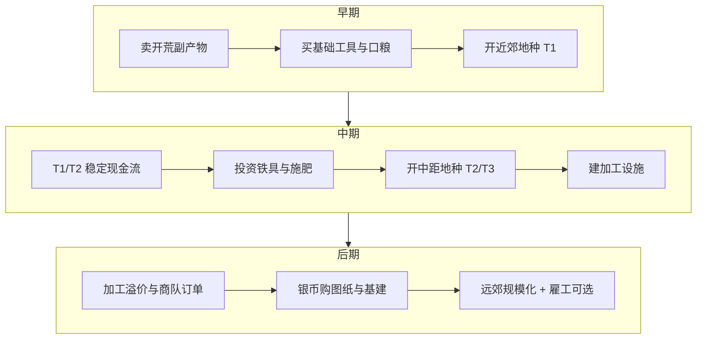

# 03 · 经济体系

[← 核心玩法](../03-核心玩法/README.md) | [返回索引](./README.md) | [下一章：随机事件 →](./随机事件系统.md)

---

经济体系采用 **「双货币 + 多资源 + 动态市场」** 结构，与 **v3 时间锚点** 联动，保证开荒、种植、交易每一环都有明确价值。

> **时间基准**：1 时间槽 = **1 现实分钟**；1 游戏日 = 20 分钟；商队周期 = 48 现实小时。详见 [07-作物生长与时间节奏](./作物生长与时间节奏.md)。

---

## 1. 货币设计

| 货币 | 获取 | 用途 | 设计意图 |
|------|------|------|----------|
| **铜币**（主货币） | 卖作物、完成任务、捡荒 | 买种子、普通工具、食物 | 日常循环 |
| **银币**（高级货币） | 大额交易、成就、商队稀有品 | 买图纸、高级工具、土地契约 | 中长期目标 |
| **声望/信誉**（软货币） | 完成商队订单、帮助 NPC | 解锁折扣、稀有种子、贷款额度 | 引导长线行为 |

**兑换关系**（固定，避免通胀失控）：

- 100 铜 = 1 银
- 声望不可直接换钱，只能换**机会**（独家商品、贷款）

---

## 2. 铜币锚点（v3）

以**活跃小时**（玩家实际操作 + 等待成熟的时间）为基准：

| 阶段 | 净铜/活跃小时 | 典型构成 |
|------|---------------|----------|
| 早期（Lv1～5） | **80～120** | 2～3 格 T1/T2 混种 + 开荒副产物 |
| 中期（Lv6～12） | **150～220** | T2/T3 占主 + 合成溢价 |
| 后期（Lv13+） | 220+ | 商队订单 + T3 合成 + 生活建设 Sink |

**机会成本**：1 现实分钟 ≈ **1.5 铜**（用于合成净利润估算）。

单格作物净收益见 [crops.json](../../config/crops.json)：

| 层级 | 生长 | 净铜/轮 | 铜/小时/格 |
|------|------|---------|------------|
| T1 | 5 min | 10 | 120 |
| T2 | 12 min | 15 | 75 |
| T3 | 20 min | 26～28 | 78～84 |
| T4 | 40 min | 52 | 78 |

多格并行 + 劳动时间槽占用后，早期玩家实际入账应落在 80～120 铜/小时。

---

## 3. 资源分类与经济角色

| 资源类型 | 例子 | 来源 | Sink（消耗出口） |
|----------|------|------|------------------|
| 可售农产品 | 土豆、小麦 | 种植 | 口粮、出售、加工 |
| 开荒副产物 | 石块、木材、纤维 | 开荒 | 建造、出售、燃料 |
| 工业中间品 | 面粉、布、木桩、肥料 | 合成设施 | 高级商品、任务、种植消耗 |
| 合成成品 | 面包、药剂、栅栏套件 | 配方合成 | 出售、基建、事件消耗 |
| 消耗品 | 食物、药水、燃料 | 购买/制作 | 精力恢复、烧荒、运输 |
| 固定资产 | 工具、设施、土地权 | 购买/建造 | 无直接消耗，占资金 |

**经济健康原则**：每一种资源至少对应 **1 个稳定来源 + 2 个以上消耗点**。

---

## 4. 价格形成机制

### 4.1 基础价格（锚定）

```
玩家出售价 = 基础价 × 品质系数 × 市场供需系数
玩家购买价 = 基础价 × 1.15～1.5 × 稀有度系数
```

### 4.2 动态供需（局部市场）

以**驿站市场**为核心，每 **48 现实小时**（商队周期）刷新：

| 因素 | 影响 |
|------|------|
| 商队周期 | 每 48h 刷新，随机「本周期高价收 X」 |
| 玩家倾销 | 同一周期大量卖同种作物 → 收购价临时 ↓ 10%～30% |
| 事件 | 旱灾 → 水类作物价 ↑；瘟疫 → 药草价 ↑（见 [04-随机事件系统](./随机事件系统.md)） |

### 4.3 运输与时间成本

| 渠道 | 特点 |
|------|------|
| 近郊市场 | 即时交易（1 时间槽），价格标准 |
| 远城商队 | 需运费 + 等待至下一周期，但高价收购稀有品 |
| 策略选择 | **卖快 vs 卖贵** |

---

## 5. 成本—收益模型（开荒 ROI）

每块地有**开垦总成本**与**生命周期收益**，玩家可通过 UI 预估。

**开垦成本** = 精力成本（折算铜币等价）+ 工具损耗 + 时间机会成本 + 种子/肥料

### 示例：1 格石砾地 → 平整田（v3）

| 项目 | 数值 |
|------|------|
| 工作量 | 150 点 |
| 铁锄效率 | 1.4 |
| 实际劳动次数 | 约 11 次 |
| 时间槽消耗 | 约 11 槽（≈ **11 现实分钟**） |
| 精力消耗 | 约 132 点 |
| 工具修理 | 8 铜 |
| 机会成本 | 若改种 T1，少收约 5 铜/轮（**5 分钟**一轮） |
| **解锁后** | T2 单轮利润 +15 铜，约 **8～10 轮**回本（≈ **1.5～2 活跃小时**） |

**设计意图**：

- 近处低品质地：**快回本**，维持早期现金流
- 远处高品质地：**高门槛、高回报**，驱动中后期扩张

---

## 6. 现金流与生命周期



---

## 7. 通胀与回收（Sink）

| Sink 类型 | 具体设计 |
|-----------|----------|
| 工具修理/更换 | 持续消耗 |
| 土地契约 | 开新区域一次性大额 |
| 设施维护费 | 每商队周期（**48h**）扣减 |
| 税收/驿站管理费 | 规模化后触发 |
| 雇工工资 | 用铜币换时间与精力 |
| 贷款利息 | 5%～12%/商队周期，早期贷款开荒，后期本息回收 |
| 灾害修复 | 随机事件造成的大额支出 |
| 防护设施 | 应对野生动物（见 [04-随机事件系统](./随机事件系统.md)） |
| 合成手续费 | 部分 T2/T3 配方消耗铜币 |
| 生活维护 | 住宅/道路每 **48h** 材料或铜（见 [09-生活与社群](./生活与社群.md)） |
| 住宅升级 | 一次性大额材料 + 铜/银 Sink |
| 道路建设 | 持续材料消耗 + 移动效率回报 |
| 材料倾销折价 | **48h 内**超量出售 → 收购价下调至 50% |
| 保险契约 | 保费，灾害损失赔付 |

---

## 8. 信贷系统

| 项目 | 说明 |
|------|------|
| 驿站贷款 | 基于信誉，借铜/银开垦远处土地 |
| 利率 | 5%～12%/商队周期（48h），逾期降信誉 |
| 意义 | 允许「先开荒后还债」的激进玩法 |
| 灾害条款 | 极端事件后延期还款，换更高利息 |

---

## 9. 任务与订单经济

| 类型 | 奖励 | 作用 |
|------|------|------|
| 日常订单 | 铜 + 少量声望 | 引导当前能产的货 |
| 商队大宗订单 | 银 + 稀有种子 | 调节中期产能方向 |
| 主线任务 | 解锁区域/工具 | 节奏闸门 |
| 成就 | 称号、皮肤、小额属性 | 长期留存 |
| 灾后重建任务 | 铜 + 声望 | 事件后的经济缓冲 |

---

## 10. 事件与经济联动摘要

随机事件带来的损失与机会，统一进入玩家账本。详见 [04-随机事件系统 · 第 6 节](./随机事件系统.md#6-与经济体系的挂钩)。

| 事件类型 | 市场反应（滞后 1 周期） |
|----------|-------------------------|
| 区域干旱 | 本地粮价↑，种子价↑ |
| 洪涝 | 根类减产，土豆价↑ |
| 野猪泛滥 | 肉价↓（供应多），皮革稳定 |
| 虫害 | 农药、药草需求↑ |

---

## 11. 作物周期与经济节奏（v3）

作物采用**现实时间生长**（见 [07-作物生长与时间节奏](./作物生长与时间节奏.md)），经济节奏由此自然形成：

| 层级 | 生长 | 周转频率 | 经济角色 |
|------|------|----------|----------|
| T1 | 5 min | 极高 | 早期现金流、新手体验 |
| T2 | 12 min | 高 | 稳定日常收入 |
| T3 | 20 min | 中 | 中期利润主力 |
| T4 | 40 min | 低 | 高单价、占用地块时间长 |

**保险**（仅覆盖随机灾害，不含「过季」类概念）：

| 类型 | 覆盖 | 保费参考 |
|------|------|----------|
| 基础保险 | 灾害减产 | 在种作物预期产值 × 8% |
| 综合保险 | 灾害 + 兽害 | 在种作物预期产值 × 15% |

---

## 12. 材料与经济平衡摘要

完整设计见 [08-材料合成与产出](./材料合成与产出.md)。

| 原则 | 说明 |
|------|------|
| 来源 | 开荒（一次性 T0）、种植副产物、采集点、事件 |
| 合成溢价 | 成品价 ≈ 原料价 × 1.15～1.5，扣除时间后仍优于裸卖原料 |
| Sink | 工具修理、肥料、基建、围栏、任务、商队 |
| 防刷 | 同一格开荒仅掉一次 T0；材料倾销 **48h** 窗口惩罚 |

**早期现金流**：卖农产品 + 开荒副产物；**中期利润**：合成 T2 交商队订单；**后期**：T3 药剂/精铁件 + 银币图纸 + **生活建设（住宅/道路）**。

---

## 13. 配置参考

| 文件 | 用途 |
|------|------|
| [time-economy.json](../../config/time-economy.json) | 时间槽、周期、铜币锚点 |
| [crops.json](../../config/crops.json) | 作物价格与净收益 |
| [materials.json](../../config/materials.json) | 材料基价与倾销规则 |
