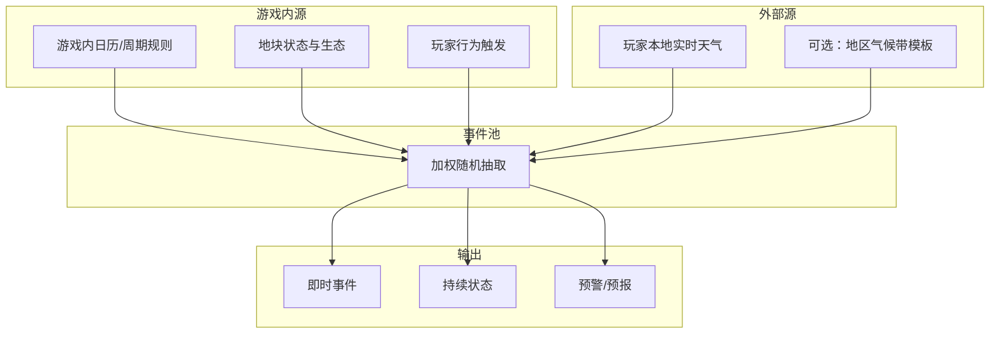

# 04 · 随机事件系统

[← 经济体系](./经济体系.md) | [返回索引](./README.md) | [下一章：进度与成长 →](./进度与成长.md)

---

## 1. 设计定位

随机事件不是单纯的「惩罚」，而是**扰动经济、迫使调整策略**的外部变量。它们与开荒、种植、市场三条线交叉，形成「计划 → 被打断 → 应对 → 新机会」的节奏。

| 原则 | 说明 |
|------|------|
| 可预见性 | 玩家能提前感知风险，而非纯黑箱 |
| 可应对性 | 每种事件至少有 2 种以上合理应对方式 |
| 有代价也有机会 | 灾害带来损失，也可能触发稀缺收益 |
| 真实感可选 | 本地天气作为「灵感来源」，不绑架核心玩法 |

---

## 2. 事件系统总架构

### 2.1 事件来源（多轨并行）



**三条轨道说明**：

1. **规则轨**：旱天提高「干旱」权重，连雨天提高「洪涝」——保证策略可学
2. **生态轨**：新开荒区域杂草多 → 啮齿类、昆虫类事件权重上升
3. **本地天气轨**：读取玩家所在城市的实时/预报天气，映射为游戏内事件倾向

> 本地天气**不直接决定**游戏内是否下雨，而是作为**权重修正器**，既保留真实感，又避免「现实连下七天雨 = 游戏七天无法玩」的极端情况。

### 2.2 权重公式

```
最终权重 = 基础权重 × 周期系数 × 本地天气系数 × 玩家防御系数
```

**保护机制**：

- 单日内同一标签事件最多触发 1 次
- 连续 3 日现实暴雨，游戏内最多升级为「中等洪涝」，不会无限叠加
- 本地天气**不直接决定**游戏内是否下雨，而是作为**权重修正器**
- 游戏内**无季节系统**；事件影响进行中作物的生长时间，不触发「过季」结算

---

## 3. 本地天气接入方案

### 3.1 接入层级

| 档位 | 权限 | 体验 |
|------|------|------|
| **关闭** | 无 | 纯游戏内随机规则 |
| **城市级**（推荐） | 仅选城市/邮编 | 用该城市天气作权重，不采集 GPS |
| **定位级** | 一次性定位或手动刷新 | 更精准，需明确隐私说明 |

### 3.2 天气数据映射表

| 现实天气 | 游戏标签 | 事件权重影响 |
|----------|----------|--------------|
| 晴 / 少云 | `clear` | 干旱、日照作物加成、火灾风险↑ |
| 多云 | `cloudy` | 中性 |
| 小雨 / 中雨 | `rain` | 积水、霉菌、部分作物生长↑ |
| 暴雨 / 雷暴 | `storm` | 洪涝、倒伏、野生动物迁徙 |
| 雪 | `snow` | 霜冻、保温需求、部分动物躲藏 |
| 雾 / 霾 | `fog` | 能见度低、野兽靠近概率↑ |
| 高温 (>35°C) | `heatwave` | 旱情、精力消耗↑、火灾 |
| 强风 | `windy` | 倒伏、栅栏损坏、鸟兽惊散 |

### 3.3 预报 UI

在「今日计划」界面增加**现实天气灵感条**（可选显示）：

```
📍 你所在城市：杭州 · 阴转小雨 · 23°C
🌾 农场感应：未来 24h 积水风险 ↑ · 建议检查排水 / 暂缓烧荒
```

玩家感到的是**参谋建议**，不是强制指令。

### 3.4 隐私与离线

- 天气缓存 6～12 小时，离线时用上次数据或退回纯游戏内规则
- 不上传精确坐标到游戏服务器时可只用客户端拉 API
- 设置页可随时关闭，关闭后 UI 不再显示现实天气

---

## 4. 天气类灾害事件

### 4.1 事件分级

| 等级 | 名称 | 持续时间 | 典型影响 |
|------|------|----------|----------|
| I | 微扰 | 数小时 | 轻微减产、精力+5% |
| II | 灾害 | 1～3 天 | 部分地块受损、工具加速损耗 |
| III | 极端 | 数日内余波 | 设施损坏、需重建/大量 Sink |

### 4.2 天气灾害目录

#### 干旱（Heat / Drought）

| 项目 | 内容 |
|------|------|
| 触发 | 游戏内长期少雨 + 现实高温/长期晴 |
| 即时 | 未灌溉地块生长暂停，T1 根茎类相对耐旱 |
| 持续 | 每日额外消耗饮水/井水；精力恢复-10% |
| 应对 | 挖井、水车、改种小米/土豆；购买储水罐 |
| 机会 | 耐旱作物收购价↑；完成「送水任务」得声望 |

#### 暴雨 / 洪涝（Storm / Flood）

| 项目 | 内容 |
|------|------|
| 触发 | 游戏内连续降雨 + 现实暴雨 |
| 即时 | 低洼地块「积水」状态，无法播种 |
| 持续 | 肥力流失、根腐病概率↑ |
| 应对 | 排水渠、抬高田埂、转移种子至仓 |
| 机会 | 捕到鱼（副产物）；洪后某些地块肥力临时+ |

#### 霜冻（Frost）

| 项目 | 内容 |
|------|------|
| 触发 | 游戏内降温 + 现实降温/降雪 |
| 即时 | 未覆盖的 T2+ **生长中**作物额外 +2 小时；**已成熟**待收作物不受影响 |
| 应对 | 稻草覆盖、烟熏法（消耗燃料）、温室（后期） |
| 机会 | 提前完成护理的作物获产量加成 |

#### 大风（Gale）

| 项目 | 内容 |
|------|------|
| 触发 | 现实强风 + 游戏内无防护林 |
| 即时 | 成熟作物倒伏（减产 20%～40%） |
| 应对 | 种植防护林带、加固栅栏 |
| 连带 | 提高「鸟群啄食」「野兽惊入」权重 |

#### 野火（Wildfire）

| 项目 | 内容 |
|------|------|
| 触发 | 烧荒操作 + 现实高温干燥 + 风力 |
| 即时 | 相邻地块连锁受损 |
| 应对 | 防火隔离带、取消烧荒、储备水桶 |
| 设计意图 | 让「烧荒捷径」带真实风险，而非无脑最优 |

#### 潮湿霉变（Mold / Blight）

| 项目 | 内容 |
|------|------|
| 触发 | 长期 rain + fog + 连续种植同科作物 |
| 即时 | 品质下降，无法卖高价 |
| 应对 | 轮作、药剂（经济 Sink）、晾晒加工 |

### 4.3 预警链

```
T-48h  远景预警（概率 30%）→ 玩家可提前加固
T-24h  确认预警（概率 → 70%）→ 市场出现相关物资涨价
T-0h   事件落地
T+     余波 / 任务（救灾、保险、收购受损粮）
```

---

## 5. 野生动物入侵事件

### 5.1 生态逻辑

开荒本质是**从野生动物栖息地中划走土地**。离安全区越远，生态事件权重越高——与「向远郊扩张」的经济回报形成对冲。


### 5.2 动物类型与行为

| 动物 | 出现区域 | 行为模式 | 主要损害 |
|------|----------|----------|----------|
| 野兔 | 近郊 | 夜间啃苗 | 幼苗损失 |
| 田鼠 | 新开垦地 | 挖洞、储粮 | 根类作物、仓储偷吃 |
| 鹿群 | 灌木边缘 | 晨昏啃食 | 叶类作物、树皮 |
| 野猪 | 中距林地 | 拱地、成群 | 大面积毁苗、破坏平整 |
| 狼/豺 | 远郊 | 围栏袭击 | 家禽、雇工士气↓ |
| 熊（稀有） | 远郊 deep | 强力破坏 | 仓库、设施 |
| 鸟群 | 作物成熟时 | 啄食 | 谷物减产 |
| 昆虫群 | 连作田 | 集中爆发 | 特定科作物 |

### 5.3 入侵事件结构

每个动物事件包含四要素：

1. **前兆**（足迹、咬痕、雇工报告）
2. **爆发**（选定目标地块/设施）
3. **持续**（未处理则 N 日内重复）
4. **结算**（损失 + 可选战利品）

**示例：野猪拱田（II 级）**

```
前兆：地块边缘出现拱痕（可布置陷阱，消耗 1 时间槽）
爆发：3×3 区域进入「践踏」状态，需重新平整（工作量 50%）
未处理：2 日内再次入侵相邻格
应对：
  - 短期：火把驱赶（消耗精力，成功率 70%）
  - 中期：尖桩栅栏（铜+木材 Sink）
  - 长期：猎户合作任务，解锁「猎人小屋」被动防御
战利品：野猪肉（可卖/做口粮，恢复精力+20%）
```

### 5.4 与本地天气的联动

| 现实天气 | 动物行为修正 |
|----------|--------------|
| 暴雨 | 小型动物躲藏，入侵↓；蛇类/蚊虫↑ |
| 干旱 | 食草动物靠近水源田，入侵↑ |
| 大雪 | 狼群靠近人类区域概率↑ |
| 雾 | 玩家「发现前兆」难度↑，但野兽也易误入陷阱 |
| 高温 | 昼间动物活跃度↓，夜间事件↑ |

### 5.5 玩家策略维度

| 策略 | 成本 | 效果 |
|------|------|------|
| 物理防护 | 木材、铜、时间 | 稳定降频 |
| 生态缓冲 | 留 1 格「边界野地」 | 降低入侵强度，略减可耕面积 |
| 驱离 | 精力、燃料 | 临时、廉价 |
| 猎捕利用 | 工具、风险 | 损失变收入 |
| 共生契约 | 声望任务 | 特定动物不再袭击，提供副产品 |
| 雇猎户 | 持续铜币 Sink | 自动化防御，效率 80% |

---

## 6. 与经济体系的挂钩

### 6.1 损失折算（进入账本）

```
地块 #14 · 野猪践踏
  直接损失：重新平整 80 工作量（≈ 35 铜机会成本）
  作物损失：玉米 ×12（≈ 48 铜）
  应对支出：尖桩栅栏 20 铜
  ─────────────────
  本期净损：103 铜
  战利品：野猪肉 ×3（+18 铜）
```

### 6.2 保险与信贷交叉

| 类型 | 说明 |
|------|------|
| 基础保险 | 保作物，不保设施 |
| 高级保险 | 含设施，保费高，需信誉 |
| 灾害条款 | 极端事件后延期还款，换更高利息 |

---

## 7. 触发规则与公平性

### 7.1 全局限制

| 规则 | 数值建议 |
|------|----------|
| 每日最大事件数 | 2（1 重大 + 1 轻微） |
| 同类事件冷却 | 3 游戏日 |
| III 级事件最低间隔 | 7 现实日 |
| 新手保护期 | 前 3 游戏日无 III 级 |

### 7.2 玩家行为反噬

| 玩家行为 | 提高权重 |
|----------|----------|
| 连续烧荒 | 野火 |
| 过度猎杀野兔 | 狼群报复（稀有） |
| 不留边界带 | 野兽入侵 |
| 连作不轮作 | 虫害 |
| 忽视排水 | 暴雨转化为洪涝，进行中作物生长暂停 |

> **事件与生长的联动**：II 级事件占用时间槽，但不影响已成熟作物的收取；进行中作物可能被暂停生长数小时。UI 可提示「N 块地已成熟，可随时收取」。

### 7.3 难度选项

| 模式 | 事件频率 | 本地天气权重 |
|------|----------|--------------|
| 休闲 | ×0.6 | ×0.5 |
| 标准 | ×1.0 | ×1.0 |
| 硬核 | ×1.4 | ×1.2，且关闭预警部分模糊 |

---

## 8. 叙事与沉浸包装

事件用**农场主日记 + 雇工口信**呈现：

> **雇工阿贵**：「东家，昨儿雾大，库房里窸窸窣窣一宿。今晨一看，少了半袋种豆。」  
> **选项**：  
> ① 设捕鼠夹（消耗 5 铜 + 1 小时）  
> ② 连夜守仓（消耗 40 精力，必抓）  
> ③ 暂不处理（触发后续「鼠患」链）

**本地天气文案示例**：

> **驿站告示**：「听闻南边几城连日落雨，运粮队延误。咱这若也雨势不停，记得把晒场上的麦子收进仓。」

---

## 9. 技术数据结构（参考）

```typescript
interface GameEvent {
  id: string;
  category: 'weather' | 'wildlife' | 'social';
  tier: 1 | 2 | 3;
  baseWeight: number;
  weatherTags: WeatherTag[];
  seasonTags: Season[];
  prerequisites: Condition[];
  phases: EventPhase[];
  responses: EventResponse[];
  economicImpact: EconomicDelta;
}

interface LocalWeatherAdapter {
  fetch(cityOrCoords): Promise<WeatherSnapshot>;
  toGameTags(snapshot): WeatherTag[];
  getForecast(hours: number): WeatherTag[];
}
```

**刷新频率**：每 6 小时或每次玩家「开始新一天」时更新一次本地天气缓存。

配置示例见 [weather-mapping.json](../../config/weather-mapping.json)。
